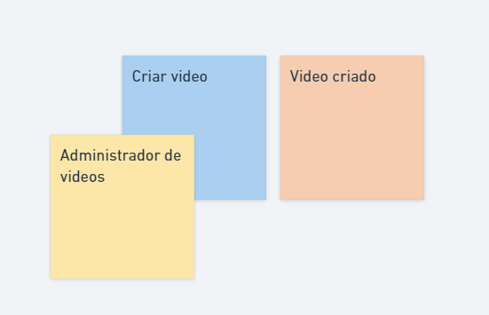

POST-IT LARANJA: Toda vez que tiver um evento *DE DOMINIO* no sistema.
Sempre irá ocorrer no passado (produto criado, produto excluido, produto adicionado ao carrinho)
POST-IT MAIOR: Indica que é um processo mais importante

* Eventos = Aquilo que ocorre no passado => compra efetuada
* Comando = Aquilo que aciona o evento => efetuar compra

Todo evento gerado é feito através de comandos, e esses eventos tem um acionador (usuário/persona) e normalmente essa persona é um domain expert

Amarelo = ator
Azul    = comando
Laranja = evento
